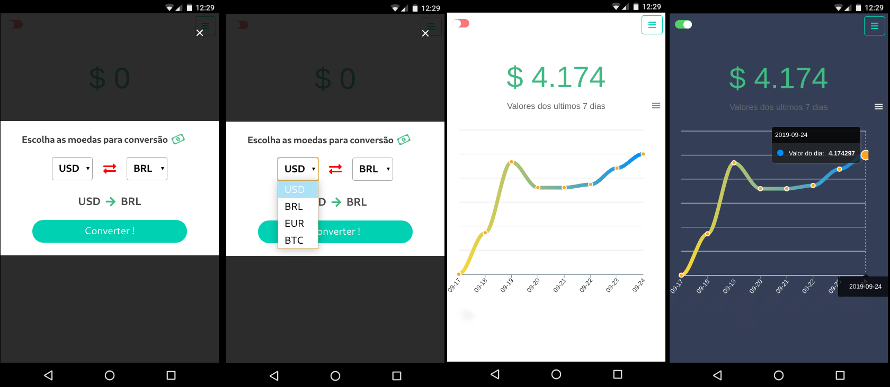
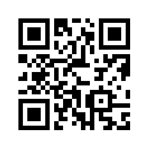

# Cashapp, A Vue.js project



### Scan this QR Code and access the app :) !


[Or click here to follow the app](http://cashapp.surge.sh/)

## Why this project ?
 The application is intended to show us the values ​​of currencies simply and directly and presenting us a small graph of how the value of the currency has changed over a short period of time.

## How it works :)

The application works for both desktops and mobile, but its focus and the mobile audience was developed as a pwa. It was developed with [Vue.js](https://vuejs.org/) and the api providing the data for free and [The Free Currency Converter](https://free.currencyconverterapi.com/).

## Build Setup

``` bash
            Clone this repository, before follow the steps.

# install dependencies
npm install

# serve with hot reload at localhost:8080
npm run dev

# build for production with minification
npm run build

```